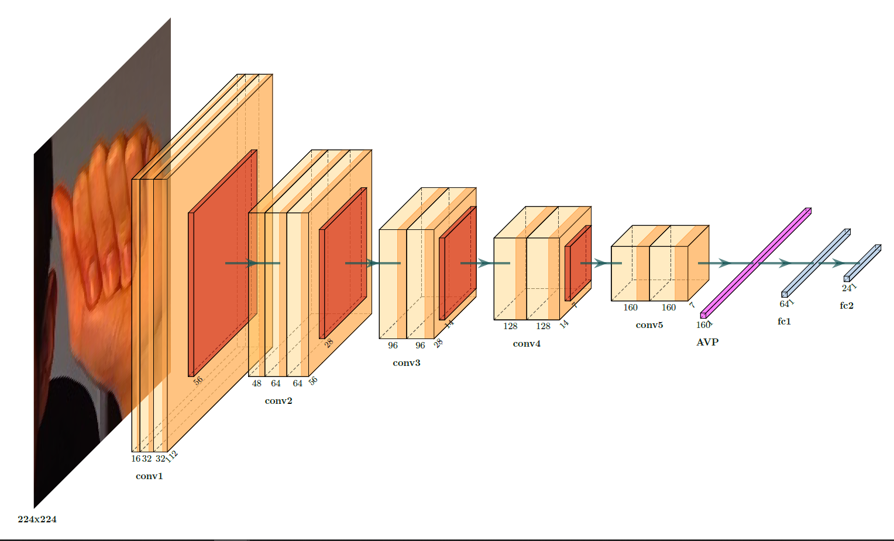
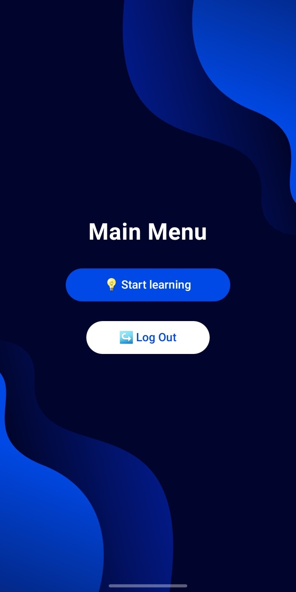
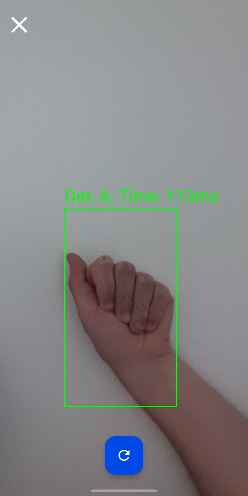
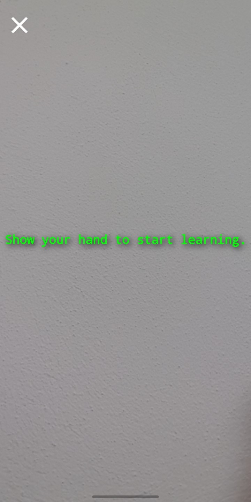
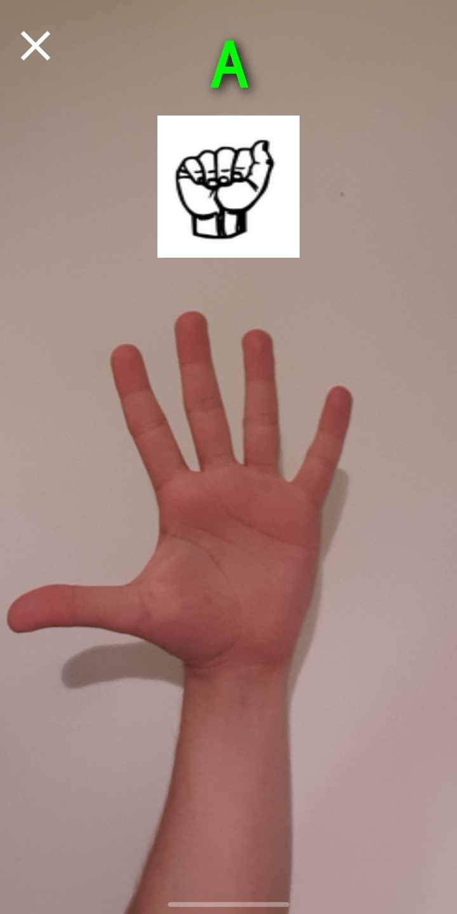

# Bachelor's Thesis - ✋ A Step Towards Understanding the ASL Alphabet

---
## 📝 Abstract

The aim of this thesis is to bridge the gap between individuals with hearing and/or
speech impairments and the general population.
The proposed solution consists of a mobile application capable of detecting and translating
the American Sign Language (ASL) alphabet. At its core, the application is composed
of a convolutional neural network, integrated into an Android mobile application.
The model follows a custom architecture, inspired by state-of-the-art models, and was
trained on a custom dataset composed of multiple sources.
During the training process, several modern regularization techniques were applied,
such as dropout, label smoothing and data augmentation, with the purpose of improving
model generalization. The final model achieved an accuracy of over 91% on a test set
representative of real-world conditions.
It can be concluded that the thesis reached its goal, the proposed model being accurate
and efficient. Moreover, the final application offers a foundation for extending the research
towards recognizing words and sentences.

---
## 📊 Dataset

* A custom dataset was built from multiple sources because most ASL alphabet datasets contained only similar images, making it difficult to train a model on a single set. Combining several sources was chosen to help the model generalize.
* The letters J and Z were eliminated because they require movement, and the model analyzes a single independent frame.
* The palms were extracted with the help of MediaPipe Hands from Google, in order to remove background noise and place the palm in the foreground.
* The final dataset contains approximately 37,000 images (36,871 images ).
* The data was split in: 82% for the training set, 9% for the validation set, and 9% for the test set

---
## 🖼️ Image Preprocessing
* All images are resized to a dimension of 224×224, normalized with the mean and standard deviation of the training set, and transformed into tensors.
* The training set images were augmented with intra-image effects (blurring, rotation, Gaussian noise, color changes) and inter-image effects (CutMix and MixUp).

---
## 🏗️ Model Architecture

* The architecture of the trained model is a custom one, inspired by popular and revolutionary architectures such as VGG and ResNet.

* It contains five convolutional blocks, summing up to a total of 12 layers, normalized with Batch Normalization and activated with the ReLU activation function.

* The first four convolutional blocks are followed by a Max Pooling layer, for halving the image, and the last block is followed by an Adaptive Average Pooling layer.

* All convolutional blocks use the first layers to extract new features, and the last layer refines and consolidates the extracted features, preserving the number of channels.

* At the end, there is a classifier formed of two fully connected layers, in which the first layer is followed by a 45% Dropout and activated with the ReLU activation function.

---
## 🥊 Training Process

* Loss Function: The loss function used is Cross Entropy with label smoothing with a factor of `0.15`.
* Optimization Algorithm: `AdamW`.
* Hyperparameters: 
  * Learning Rate: `0.001`  adjusted with `Cosine Annealing`, down to `0.00001`.
  * Weight Decay: `0.000001`
  * `60` epochs, batch size of `64`.

---
## 📈 Model Evaluation

* The final accuracy on a test set representative of the real environment is over 91%.
* Accuracy results: `training` - `92.45%`; `validation` - `92.27%`; `testing` - `91.06%`.
* Validation accuracy remained constantly above the training accuracy, probably an effect of intense augmentations and regularization.

---
## 📱 Mobile application

* The mobile application has an infrastructure based on four `Docker` containers: 
  * The `uvicorn` server, with the application logic written in `Python` with `FastAPI`. Security is ensured by the `bcrypt` library, through which sensitive data stored on the server is hashed, and the authentication mechanism is based on `Json Web Tokens (JWT)`.
  * The container containing the `PostgreSQL` database ensures data persistence, saving registered users.
  * The `REDIS` container ensures quick access to email address validation codes and JWT refresh tokens.
  * The entry point of the application is represented by the `NGINX` container, which has the role of a reverse proxy.
* The application interface is written in Kotlin.

---
* `Main Menu Screen`

---
* `Free Detection`

---
* `Start Learning Screen`

---
* `Learning Session Screen`

